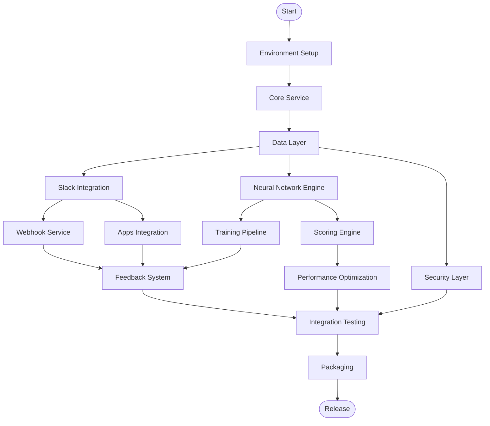

# SlackGrab Dependencies & Build Order

## Executive Summary

This document defines the dependency graph for SlackGrab components, enabling parallel development across multiple teams. The critical path is 9 weeks, with significant parallelization opportunities in weeks 3-6.

## Dependency Graph Overview



## Critical Path Analysis

### Critical Path Sequence (9 weeks)
1. **Week 1**: Environment Setup → Core Service
2. **Week 2**: Data Layer
3. **Week 3-4**: Slack Integration
4. **Week 5-6**: Webhook Service & Apps Integration
5. **Week 7-8**: Feedback System
6. **Week 9**: Integration Testing & Packaging

### Parallel Paths (Can be done simultaneously)
- **Path A**: Slack Integration → Webhook → Apps → Feedback
- **Path B**: Neural Network → Training → Scoring → Performance
- **Path C**: Security → Encryption → Credential Management
- **Path D**: Testing Infrastructure (throughout)

## Component Dependencies

### Layer 0: Foundation (No Dependencies)
These components must be built first:

#### Environment Setup
- **Components**: Build configuration, project structure
- **Dependencies**: None
- **Outputs**: Gradle build files, directory structure
- **Team**: DevOps/Build Engineer
- **Duration**: 2 days

#### Core Service Framework
- **Components**: Application entry point, service coordinator
- **Dependencies**: Environment Setup
- **Outputs**: Main application skeleton, DI framework
- **Team**: Senior Developer
- **Duration**: 3 days

### Layer 1: Data Foundation
Must be complete before most other components:

#### Data Layer
- **Components**: SQLite setup, repositories, encryption
- **Dependencies**: Core Service
- **Outputs**: Database schema, repository interfaces
- **Team**: Backend Developer
- **Duration**: 5 days
- **Interfaces Required**:
  ```java
  interface MessageRepository
  interface TrainingDataRepository
  interface MetricsRepository
  ```

### Layer 2: Core Features (Parallel Development)
These can be developed in parallel after Layer 1:

#### Stream A: Slack Integration
- **Components**: OAuth, API client, rate limiting
- **Dependencies**: Data Layer
- **Outputs**: Slack API wrapper, OAuth flow
- **Team**: Integration Developer
- **Duration**: 10 days
- **Interfaces Required**:
  ```java
  interface SlackApiClient
  interface OAuthManager
  interface RateLimiter
  ```

#### Stream B: Neural Network Engine
- **Components**: DL4J setup, model architecture, GPU acceleration
- **Dependencies**: Data Layer
- **Outputs**: Neural network model, inference engine
- **Team**: ML Engineer
- **Duration**: 10 days
- **Interfaces Required**:
  ```java
  interface NeuralNetwork
  interface FeatureExtractor
  interface ImportanceScorer
  ```

#### Stream C: Security Layer
- **Components**: Encryption, credential management, Windows integration
- **Dependencies**: Data Layer
- **Outputs**: Encryption service, credential store
- **Team**: Security Developer
- **Duration**: 5 days
- **Interfaces Required**:
  ```java
  interface EncryptionService
  interface CredentialManager
  ```

### Layer 3: Integration Components
Depend on Layer 2 components:

#### Webhook Service
- **Components**: HTTP server, event processing
- **Dependencies**: Slack Integration, Security Layer
- **Outputs**: Webhook endpoints, event handlers
- **Team**: Backend Developer
- **Duration**: 5 days

#### Apps Integration
- **Components**: Bot setup, UI components, slash commands
- **Dependencies**: Slack Integration
- **Outputs**: Slack Apps UI, bot commands
- **Team**: Integration Developer
- **Duration**: 5 days

#### Training Pipeline
- **Components**: Incremental learning, data pipeline
- **Dependencies**: Neural Network Engine, Data Layer
- **Outputs**: Training loop, model updates
- **Team**: ML Engineer
- **Duration**: 5 days

#### Scoring Engine
- **Components**: Real-time scoring, caching
- **Dependencies**: Neural Network Engine
- **Outputs**: Scoring service, cache layer
- **Team**: ML Engineer
- **Duration**: 3 days

### Layer 4: User Features
Depend on Layer 3:

#### Feedback System
- **Components**: Three-level feedback, batch processing, undo
- **Dependencies**: Apps Integration, Training Pipeline
- **Outputs**: Feedback handlers, training data generation
- **Team**: Full Stack Developer
- **Duration**: 5 days

#### Performance Optimization
- **Components**: Resource management, throttling
- **Dependencies**: Scoring Engine, Training Pipeline
- **Outputs**: Optimized pipelines
- **Team**: Performance Engineer
- **Duration**: 5 days

### Layer 5: Testing & Packaging
Final integration:

#### Integration Testing
- **Components**: End-to-end tests, performance tests
- **Dependencies**: All components
- **Outputs**: Test suite, test results
- **Team**: QA Engineer
- **Duration**: 5 days

#### Packaging
- **Components**: Installer, distribution
- **Dependencies**: Integration Testing
- **Outputs**: Windows installer
- **Team**: DevOps Engineer
- **Duration**: 2 days

## Parallel Development Groups

### Group 1: ML Team (2 developers)
Can work independently after Data Layer:
- Neural Network Engine
- Training Pipeline
- Scoring Engine
- Performance Optimization

### Group 2: Integration Team (2 developers)
Can work independently after Data Layer:
- Slack Integration
- Webhook Service
- Apps Integration
- Feedback System

### Group 3: Platform Team (1 developer)
Can work independently after Core Service:
- Security Layer
- Windows Integration
- System Tray
- Resource Monitoring

### Group 4: QA Team (1 developer)
Can work throughout:
- Mock Slack API
- Test Infrastructure
- Integration Tests
- Performance Tests

## Shared Dependencies

### Libraries Used by Multiple Components

#### Used by 3+ components:
- **SLF4J/Logback**: All components (logging)
- **Guava**: Core Service, Data Layer, ML Engine (utilities)
- **Guice**: All major components (dependency injection)
- **JUnit/Mockito**: All components (testing)

#### Used by 2 components:
- **Slack SDK**: Slack Integration, Apps Integration
- **DL4J**: Neural Network Engine, Training Pipeline
- **SQLite JDBC**: Data Layer, Metrics
- **OkHttp**: Slack Integration, Webhook Service

### Shared Interfaces

#### Critical Interfaces (Block multiple components):
1. `MessageRepository`: Used by Slack Integration, ML Engine, Feedback
2. `ImportanceScorer`: Used by Scoring Engine, Apps Integration
3. `SlackApiClient`: Used by Slack Integration, Apps, Webhook
4. `TrainingDataRepository`: Used by ML Engine, Feedback System

#### Secondary Interfaces:
1. `EncryptionService`: Used by Data Layer, Security
2. `MetricsCollector`: Used by all components for monitoring
3. `ErrorHandler`: Used by all components for error management

## Integration Milestones

### Milestone 1: Foundation Complete (Week 2)
- Core Service running
- Data Layer functional
- Basic logging and error handling
- **Deliverable**: Skeleton application with database

### Milestone 2: Core Features Complete (Week 4)
- Slack API connection working
- Neural Network scoring functional
- Security layer implemented
- **Deliverable**: Can connect to Slack and score messages

### Milestone 3: Real-time Processing (Week 6)
- Webhook server receiving events
- Apps UI displaying priorities
- Training pipeline processing feedback
- **Deliverable**: Real-time message prioritization

### Milestone 4: Full Feature Set (Week 8)
- Feedback system complete
- Performance optimization done
- All user stories implemented
- **Deliverable**: Feature-complete application

### Milestone 5: Production Ready (Week 9)
- Integration tests passing
- Performance benchmarks met
- Installer created
- **Deliverable**: Shippable product

## Development Sequence Recommendations

### Week 1-2: Foundation Sprint
**Team**: Full team
**Focus**: Get foundation running
1. Day 1-2: Environment setup, build configuration
2. Day 3-5: Core service, application framework
3. Day 6-10: Data layer, database schema

### Week 3-4: Parallel Development Sprint
**Team**: Split into groups
**Focus**: Build core features in parallel

**ML Team**:
- Neural network architecture
- Feature extraction
- Basic scoring

**Integration Team**:
- Slack OAuth
- API client
- Rate limiting

**Platform Team**:
- Encryption service
- Credential management
- Windows integration

### Week 5-6: Integration Sprint
**Team**: Paired programming
**Focus**: Connect components

**Pairs**:
- ML + Integration: Connect scoring to Slack
- Platform + Integration: Secure API tokens
- QA + All: Test infrastructure

### Week 7-8: Feature Sprint
**Team**: Feature teams
**Focus**: User-facing features
- Feedback system
- Performance optimization
- Apps UI polish

### Week 9: Release Sprint
**Team**: Full team
**Focus**: Ship it
- Integration testing
- Bug fixes
- Packaging
- Documentation

## Dependency Risk Mitigation

### High-Risk Dependencies
1. **Slack API Changes**: Use official SDK, version lock
2. **DL4J GPU Support**: Implement CPU fallback early
3. **Windows Credential Manager**: Alternative secure storage ready

### Mitigation Strategies
1. **Mock Implementations**: Create mocks for external dependencies
2. **Interface-First**: Define all interfaces before implementation
3. **Feature Flags**: Allow disabling problematic features
4. **Fallback Paths**: Every external dependency has fallback

## Team Allocation Matrix

| Week | ML Team | Integration Team | Platform Team | QA Team |
|------|---------|-----------------|---------------|---------|
| 1 | Environment Setup | Environment Setup | Environment Setup | Test Infrastructure |
| 2 | Data Layer | Data Layer | Core Service | Mock Slack API |
| 3 | Neural Network | Slack Integration | Security Layer | Unit Tests |
| 4 | Training Pipeline | OAuth Flow | Windows Integration | Integration Tests |
| 5 | Scoring Engine | Webhook Service | Resource Monitor | Performance Tests |
| 6 | GPU Optimization | Apps Integration | System Tray | Load Tests |
| 7 | Model Tuning | Feedback System | Error Handling | E2E Tests |
| 8 | Performance | Bot Commands | Auto-start | Regression Tests |
| 9 | Bug Fixes | Bug Fixes | Packaging | Final Validation |

## Component Interface Contracts

### Data Layer → All Components
```java
public interface DataLayerContract {
    MessageRepository messages();
    TrainingDataRepository training();
    MetricsRepository metrics();
    TransactionManager transactions();
}
```

### Neural Network → Slack Integration
```java
public interface ScoringContract {
    ImportanceScore score(Message message);
    void updateModel(Feedback feedback);
    boolean isReady();
}
```

### Slack Integration → Apps UI
```java
public interface SlackUIContract {
    void displayPriorities(List<PrioritizedMessage> messages);
    void registerCommand(SlashCommand command);
    void sendBotMessage(String channel, String message);
}
```

## Build Order Summary

### Sequential Requirements (Must be in order):
1. Environment Setup
2. Core Service
3. Data Layer
4. (Components can parallelize after this)

### Parallel Opportunities:
- **Week 3-6**: 3 parallel streams
- **Week 7-8**: 2 parallel streams

### Integration Points (Require synchronization):
- Week 4 End: API contracts finalized
- Week 6 End: Integration testing begins
- Week 8 End: Feature freeze

## Continuous Integration Strategy

### Branch Strategy
- `main`: Stable, tested code
- `develop`: Integration branch
- `feature/*`: Individual features
- `release/*`: Release preparation

### Merge Requirements
1. All tests passing
2. Code review approved
3. No decrease in coverage
4. Performance benchmarks met

### Daily Integration
- 10 AM: Component teams merge to develop
- 2 PM: Integration tests run
- 4 PM: Fix any integration issues
- 6 PM: Develop merged to main if stable

## Conclusion

This dependency structure enables efficient parallel development while maintaining clear integration points. The critical path of 9 weeks can potentially be shortened to 7-8 weeks with aggressive parallelization and strong team coordination. Key success factors:

1. **Early Interface Definition**: All interfaces defined by Week 2
2. **Parallel Development**: 3 teams working independently Weeks 3-6
3. **Regular Integration**: Daily integration tests from Week 4
4. **Clear Milestones**: Weekly deliverables with defined acceptance criteria
5. **Risk Mitigation**: Fallbacks for all external dependencies

The architecture supports a team of 6-7 developers working efficiently without blocking each other, with clear handoff points and integration milestones.